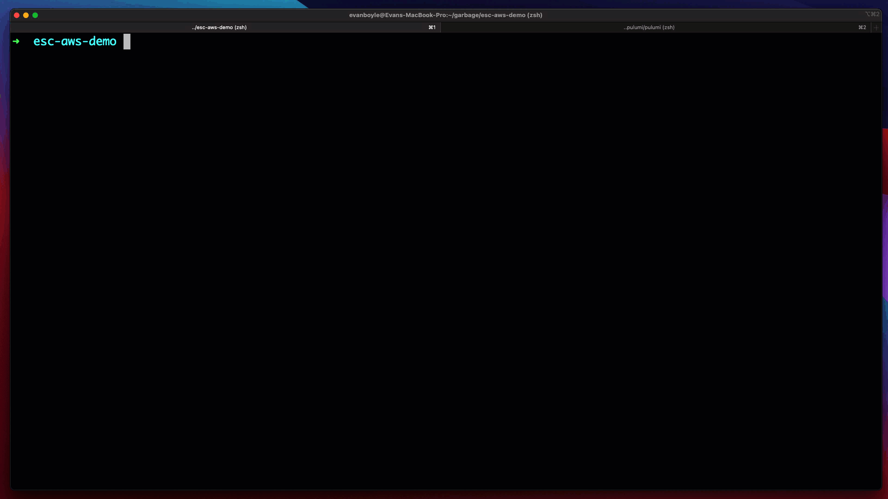
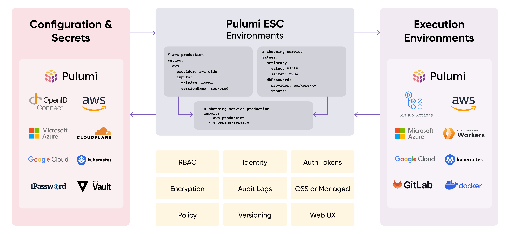

# Pulumi ESC (Environments, Secrets, and Configuration)

Pulumi ESC is a new product from Pulumi that manages and tames secrets and configuration complexity across all of your cloud infrastructure and application environments. Pulumi ESC introduces a new category of configuration-as-code product, motivated by our experience working with hundreds of Pulumi IaC customers to address their needs in managing secrets and configuration at scale within their Pulumi infrastructure and across other cloud applications and infrastructure projects.

Pulumi ESC enables teams to aggregate secrets and configuration from many sources, manage hierarchical collections of configuration and secrets ("environments"), and consume those configuration and secrets from a variety of different infrastructure and application services.  Pulumi ESC works hand-in-hand with Pulumi IaC to simplify configuration management, but also works independently from Pulumi IaC, as a solution for managing environments, secrets and configuration for any application or infrastructure project.

For example, the Pulumi ESC CLI (`esc`) makes it possible to give your developers immediate, just-in-time authenticated and short-lived access to cloud credentials across any cloud provider with just a single command: `esc run aws-staging -- aws s3 ls`.



Pulumi ESC is offered as a managed service as part of Pulumi Cloud, and this repo contains the implementation of the following key components of the ESC offering:

1. The `esc` CLI:  A CLI tool for managing and consuming environments, secrets and configuration using Pulumi ESC.
2. The Pulumi ESC evaluator:  The core specification and implementation of the document format for defining environments, and the syntax and semantics for evaluating environments to produce a set of configuration and secrets.

## Resources

* [Getting Started](https://pulumi.com/docs/pulumi-cloud/esc/get-started)
* [Download and Install](https://pulumi.com/docs/install/esc/)
* [Documentation](https://pulumi.com/docs/pulumi-cloud/esc)
* [Community Slack](https://slack.pulumi.com/)


## How Pulumi ESC works



1. Pulumi ESC enables you to define environments, which are collections of secrets and configuration. Each environment can be composed from  multiple environments.
2. Pulumi ESC supports a variety of configuration and secrets sources, and it has an extensible plugin model that allows third-party sources.
3. Pulumi ESC has a rich API that allows for easy integration.  Every value in an environment can be accessed from any execution environment.
4. Every environment can be locked down with RBAC, versioned, and audited.

## Building the CLI Locally

You can build the CLI locally for testing by running:

```shell
$ make install
```

This will produce an `esc` binary in your `GOBIN` directory.

## Why Pulumi ESC?

Pulumi ESC was designed to address a set of challenges that many infrastructure and application development teams face in managing configuration and secrets across their various environments:

* __Secrets and Configuration Sprawl__: Data in many systems. Challenging to audit. Lots of application-specific logic to acquire and compose configuration from multiple sources. Divergent solutions for Infrastructure and Application configuration.
* __Duplication and Copy/Paste__: Secrets are duplicated in many places. Frequently coupled to application/system-specific configuration stores.
* __Too Many Long-lived Static Secrets__: Long lived static credentials are over-used, exposing companies to significant security risk.  Rotation is operationally challenging. Not all systems support direct integration with OIDC and other dynamic secrets provisioning systems.

Pulumi ESC was born to address these problems and needs head on.  It does so through a few core design principles:

* __Hierarchical and Composable__: Environments contain collections of secrets and configuration, but can also import one or more other environments.  Values can be overridden, interpolated from other values, and arbitrarily nested.  This allows for flexible composition and reuse, and avoids copy paste.
* __Any Secrets Provider__:  Support for dynamic configuration providers allow Pulumi ESC to integrate with secrets stored in any other provider.  Organizations often use AWS Secrets Manager, Vault, Azure OIDC and/or 1Password plus many more sources of truth for their secrets and configuration.  Pulumi ESC supports them all, providing a single interface to your configuration and secrets, no matter where their source of truth is.  Pulumi ESC works with these tools to provide improved management of secrets and configuration.
* __Consume from Anywhere__: The `esc` CLI and the Pulumi ESC Rest API enables environments to be accessed from any application, infrastructure provider, automation system.  At launch, first-class integrations are available with Pulumi IaC, local environment and .env files, GitHub Actions, and more.
* __Auditable__: Environments must be “opened” to compute and see the set of value they provide, and this action is recorded in audit logs, including a full record of how each value was sourced from within the hierarchy of environments that contributed to it.
* __Authentication and RBAC__:  Pulumi ESC brokers access to secrets and configuration that live in other systems, and so authentication and granular RBAC are critical to ensure robust access controls across your organization.  Pulumi ESC leverages the same Pulumi Cloud identity, RBAC, Teams, SAML/SCIM and scoped access tokens that are used for Pulumi IaC today, extending these all to managing access to Environments as well as Stacks.
* __Configuration as Code__:  Environments are defined as YAML documents which can describe how to project and compose secrets and configuration, integrate dynamic configuration providers, and compute new configuration from other values (construing a URL from a DNS name, or concatenating multiple configuration values into a derived value).  The incredible flexibility of a code-based approach over traditional point-and-click interfaces allows Pulumi ESC to offer rich expressiveness for managing complex configuration.
* __Fully Managed__: Pulumi ESC is offered as a fully managed cloud service in Pulumi Cloud (and Pulumi Cloud Self-hosted in the near future). The pulumi/esc project is open source, and contains the evaluation engine for environments, the esc CLI, and in the future, the extensible plugins for source and target integrations.


