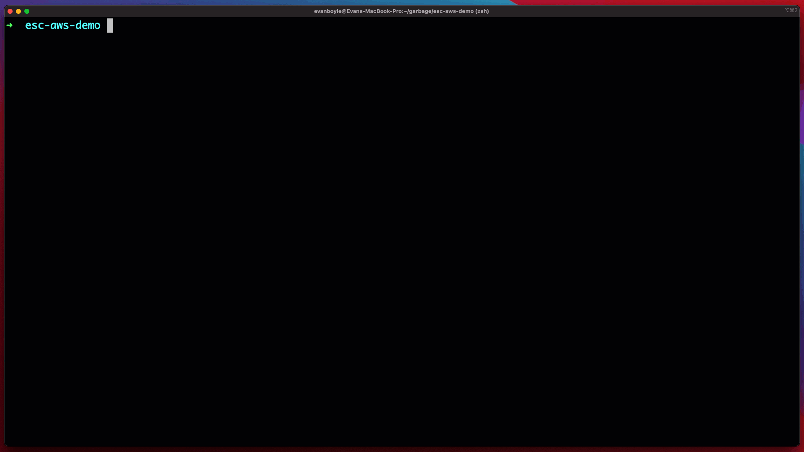

<p align="center">
  <a href="https://www.pulumi.com?utm_campaign=pulumi-esc-github-repo&utm_source=github.com&utm_medium=top-logo" title="Pulumi ESC: Open source secrets management solution">
    
   </a>

  [](LICENSE)
  [](https://slack.pulumi.com?utm_campaign=pulumi-esc-github-repo&utm_source=github.com&utm_medium=slack-badge)
  [](https://x.com/PulumiCorp)
</p>

# Pulumi ESC (Environments, Secrets, and Configuration)

**[Pulumi ESC](https://www.pulumi.com/product/esc/)** is an open source secrets management platform that tames secrets and configuration complexity across all of your cloud infrastructure and application environments.

With Pulumi ESC, teams can aggregate secrets and configurations from many sources, manage hierarchical collections of configurations and secrets as environments, and consume them through a variety of means including CLI, SDK, REST API, Pulumi Cloud Web Console and Pulumi-service provider.

Pulumi ESC not only works great for your applications and IaC, including Pulumi IaC, but it also makes your day-to-day developer workflow much more secure and streamlined. For example, the Pulumi ESC CLI (esc) allows you to give your developers immediate, just-in-time authenticated, and short-lived access to cloud credentials across any cloud provider with just a single command: `esc run aws-staging -- aws s3 ls`.

In this example, an ESC environment named aws-staging has all the necessary staging environment configuration and OIDC setup to connect to AWS. Running this command opens up a temporary environment and executes the aws s3 ls command in that environment. The temporary AWS credentials are not stored anywhere, making them secure and also allowing you to switch between different environments dynamically.



Pulumi ESC is also offered as a managed service as part of [Pulumi Cloud,](https://www.pulumi.com/product/pulumi-cloud/?utm_campaign=pulumi-esc-github-repo&utm_source=github.com) and this repo contains the implementation of the following key components of the ESC open source secrets and configuration management solution:

1. The `esc` CLI:  A CLI tool for managing and consuming environments, secrets and configuration using Pulumi ESC.
2. The Pulumi ESC evaluator:  The core specification and implementation of the document format for defining environments, and the syntax and semantics for evaluating environments to produce a set of configuration and secrets.

<div>
<a href="https://www.pulumi.com/docs/esc/get-started/?utm_campaign=pulumi-esc-github-repo&utm_source=github.com&utm_medium=get-started-button" title="Get Started">
    
</a>
</div>

## Table of contents

- :rocket: [Getting Started](#getting-started-with-pulumi-esc)
- :blue_book: [Documentation](https://pulumi.com/docs/pulumi-cloud/esc)
- :hammer_and_wrench: [How Pulumi ESC Works](#how-pulumi-esc-works)
- :white_check_mark: [Pulumi ESC Features](#pulumi-esc-features)
- :compass:	[Pulumi ESC Roadmap](#resources)
- :busts_in_silhouette: [Community](#resources)
- :computer: [Resources](#resources)

## Getting Started with Pulumi ESC

For a hands-on, self-paced tutorial see our Pulumi ESC [Getting Started](https://pulumi.com/docs/pulumi-cloud/esc/get-started?utm_campaign=pulumi-esc-github-repo&utm_source=github.com&utm_medium=getting-started-install) to quickly get up and running.

### Download and Install Pulumi ESC

1. **Install**:

    To install the latest Pulumi ESC release, run the following (see full
    [installation instructions](https://www.pulumi.com/docs/install/esc/?utm_campaign=pulumi-esc-github-repo&utm_source=github.com&utm_medium=getting-started-install) for additional installation options):

    ```bash
    $ curl -fsSL https://get.pulumi.com/ | sh
    ```

### Building the ESC CLI Locally

You can build the CLI locally for testing by cloning this repo and running:

```shell
$ make install
```

This will produce an `esc` binary in your `GOBIN` directory.

## How Pulumi ESC Works


1. Pulumi ESC enables you to define environments, which are collections of secrets and configuration. Each environment can be composed from multiple environments.
2. Pulumi ESC supports a variety of configuration and secrets sources, and it has an extensible plugin model that allows third-party sources.
3. Pulumi ESC has a rich API that allows for easy integration.  Every value in an environment can be accessed from any execution environment.
4. Every environment can be locked down with RBAC, versioned, and audited.

### Why Pulumi ESC?

Pulumi ESC was designed to address a set of challenges that many infrastructure and application development teams face in managing configuration and secrets across their various environments:

* __Secrets and Configuration Sprawl__: Data in many systems. Challenging to audit. Lots of application-specific logic to acquire and compose configuration from multiple sources. Divergent solutions for Infrastructure and Application configuration.
* __Duplication and Copy/Paste__: Secrets are duplicated in many places. Frequently coupled to application/system-specific configuration stores.
* __Too Many Long-lived Static Secrets__: Long lived static credentials are over-used, exposing companies to significant security risk.  Rotation is operationally challenging. Not all systems support direct integration with OIDC and other dynamic secrets provisioning systems.

Pulumi ESC was born to address these problems and needs head on with the following features.

### Pulumi ESC Features

* __Hierarchical Environments__: Environments contain collections of secrets and configuration, but can also import one or more other environments. Values can be overridden, interpolated from other values, and arbitrarily nested. This allows for flexible composition and reuse, and avoids copy paste.
* __Dynamic + Static Secrets__: Supports static values and dynamic values pulled from systems; static values can be encrypted, and dynamic secrets plugins include AWS OIDC, HashiCorp Vault, AWS Secrets Manager, 1Password, and Pulumi StackReference.
* __Auditable__: Every environment opening is recorded in audit logs, providing a concrete set of configuration derived from imported environments and dynamic secrets.
* __Consume from Anywhere__: The `esc` CLI and the Pulumi ESC Rest API enable environments to be accessed from any application, infrastructure provider, or automation system. At launch, first-class integrations are available with Pulumi IaC, local environment and .env files, GitHub Actions, and more.
* __Authentication and RBAC__: Pulumi ESC brokers access to secrets and configuration that live in other systems, and so authentication and granular RBAC are critical to ensure robust access controls across your organization. Pulumi ESC leverages the same Pulumi Cloud identity, RBAC, Teams, SAML/SCIM and scoped access tokens that are used for Pulumi IaC today, extending these all to managing access to Environments as well as Stacks.
* __Configuration as Code__: Environments are defined as YAML documents which describe how to project and compose secrets and configuration, integrate dynamic configuration providers, and compute new configuration from other values (construing a URL from a DNS name, or concatenating multiple configuration values into a derived value). The incredible flexibility of a code-based approach over traditional point-and-click interfaces allows Pulumi ESC to offer rich expressiveness for managing complex configuration.
* __Open Source + Managed__: Offers an open-source server with pluggable storage and authentication, as well as a managed service in Pulumi Cloud and Pulumi Cloud Self-hosted options.
* __Version Control and Rollback__: Manage environment changes with full auditability and rollback capabilities.
* __Language SDKs__: Use ESC in Python, TypeScript/JavaScript, and Go applications.
* __Traceability and Auditing__: Environments must be “opened” to compute and see the set of values they provide, and this action is recorded in audit logs, including a full record of how each value was sourced from within the hierarchy of environments that contributed to it.
* __Composable Environments__: Combine multiple environments for greater flexibility.
* __Dynamic Configuration Providers__: Support for dynamic configuration providers for more flexible management.
* __Fully Managed__: Pulumi ESC is offered as a fully managed cloud service in Pulumi Cloud (and Pulumi Cloud Self-hosted in the near future). The pulumi/esc project is open source, and contains the evaluation engine for environments, the esc CLI, and in the future, the extensible plugins for source and target integrations.

## Pulumi ESC Roadmap

Review the planned work for the upcoming quarter and a selected backlog of issues that are on our mind but not yet scheduled on the [Pulumi Roadmap.](https://github.com/orgs/pulumi/projects/44)

## Community

- Join us in the [Pulumi Community Slack](https://slack.pulumi.com/?utm_campaign=pulumi-esc-github-repo&utm_source=github.com&utm_medium=welcome-slack) to connect with our community and engineering team and ask questions. All conversations and questions are welcome.
- Send us a tweet via [@PulumiCorp](https://twitter.com/PulumiCorp)
- Watch videos and workshops on [Pulumi TV](https://www.youtube.com/pulumitv)

## Resources

- [Docs](https://pulumi.com/docs/pulumi-cloud/esc?utm_campaign=pulumi-esc-github-repo&utm_source=github.com&utm_medium=esc-resources)
- [Slack](https://slack.pulumi.com/?utm_campaign=pulumi-esc-github-repo&utm_source=github.com&utm_medium=welcome-slack)
- [Twitter](https://twitter.com/PulumiCorp)
- [YouTube](https://www.youtube.com/pulumitv)
- [Blog](https://pulumi.com/blog?utm_campaign=pulumi-esc-github-repo&utm_source=github.com&utm_medium=esc-resources)
- [Roadmap](https://github.com/orgs/pulumi/projects/44)
